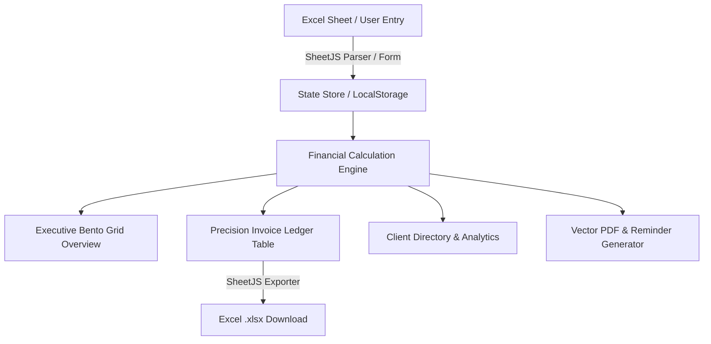

# Invoice Tracker Documentation

Welcome to the comprehensive documentation for **Invoice Tracker** — a precision financial receivables ledger and cash flow tracking application built for freelancers, agencies, finance managers, and small businesses.

---

## Documentation Index

| Document | Description |
| :--- | :--- |
| **[Architecture & System Design](./architecture.md)** | High-level system architecture, component topology, state management, and data flow pipelines. |
| **[Financial Calculation Engine](./financial-engine.md)** | Mathematical specifications for multi-currency conversion, dynamic aging, DSO, tax deductions (TDS), and aggregation algorithms. |
| **[Data Schema & Data Models](./data-schema.md)** | Full entity models (Invoices, Clients, Settings), storage keys, and bidirectional Excel `.xlsx` mapping specifications. |
| **[Component Catalog & API Reference](./components.md)** | Detailed documentation of all React components, props, state machines, and user interface workflows. |
| **[Bento Grid & Design System](./design-system.md)** | Design tokens, OKLCH color palettes (Dark/Light themes), Bento Grid specifications, typography, and accessibility. |
| **[User Guide & Workflows](./user-guide.md)** | Step-by-step manual for issuing invoices, recording settlements, importing/exporting Excel files, and generating PDF invoices. |

---

## Executive Overview

**Invoice Tracker** was engineered to replace fragile manual Excel spreadsheets (specifically modeled after `Invoice Tracker.xlsx`) with an automated, reactive, and robust web application.



### Core Capabilities
- **Bento Grid Executive Dashboard**: High-density modular overview displaying realized cash flow, collection rates, active pending balances, overdue aging, and monthly trends.
- **Dynamic Aging & Payment Term Calculators**: Automated computation of due dates, days outstanding, days to collect, and overdue duration based on terms (Net 0, 15, 30, 45, 60, Custom).
- **Tax & TDS Withholding Reconciliation**: Direct support for gross vs net amounts with automated tax deduction percentages (e.g. 15% withholding tax) and remarks logging.
- **Multi-Currency Normalization**: Real-time conversion engine allowing portfolio totals in a customizable Base Currency (`USD`, `EUR`, `GBP`, `CHF`, `INR`, `CAD`, `AUD`, `SGD`) while preserving native transaction currencies.
- **Bidirectional Excel Interoperability**: Flawless 1-click export to `.xlsx` maintaining exact column headers and structure from the original spreadsheet, plus drag-and-drop file import.
- **Vector PDF & Reminder Generator**: Client-side branded PDF invoice generation and instant email payment reminder template generator.
- **Zero-Backend Privacy**: 100% client-side persistence via `localStorage`, offline-first readiness, and zero telemetry.

---

## Quick Start for Developers

```bash
# 1. Install dependencies
npm install

# 2. Run local development server
npm run dev

# 3. Build for production
npm run build

# 4. Preview production build
npm run preview
```

---

## Technology Stack

- **Framework**: React 18 (`react`, `react-dom`)
- **Build Tool**: Vite 5 (`vite`, `@vitejs/plugin-react`)
- **Styling**: Handcrafted Vanilla CSS with OKLCH color tokens, Bento Grid layout, and zero third-party UI framework bloat.
- **Iconography**: Lucide Icons (`lucide-react`)
- **Excel Processing**: SheetJS (`xlsx`)
- **PDF Generation**: jsPDF (`jspdf`)
- **Celebration Effects**: Canvas Confetti (`canvas-confetti`)
