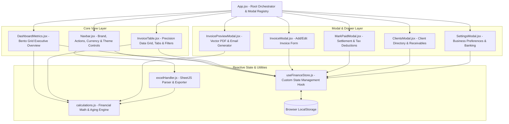
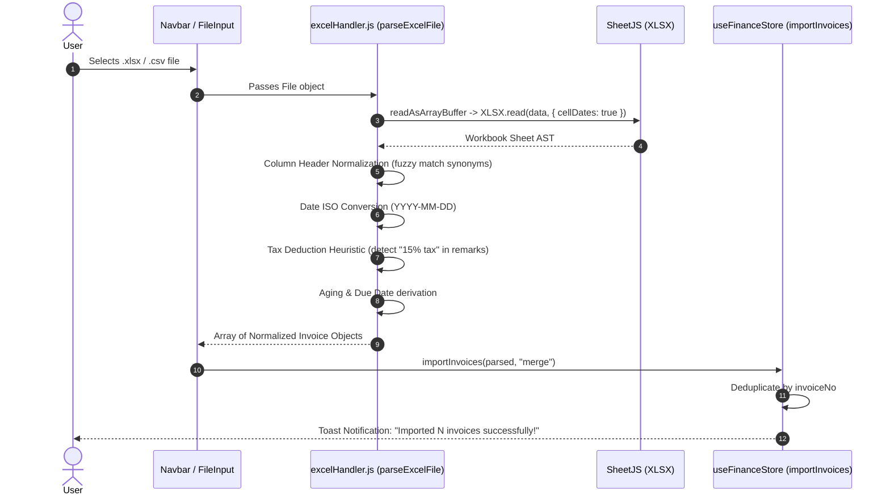
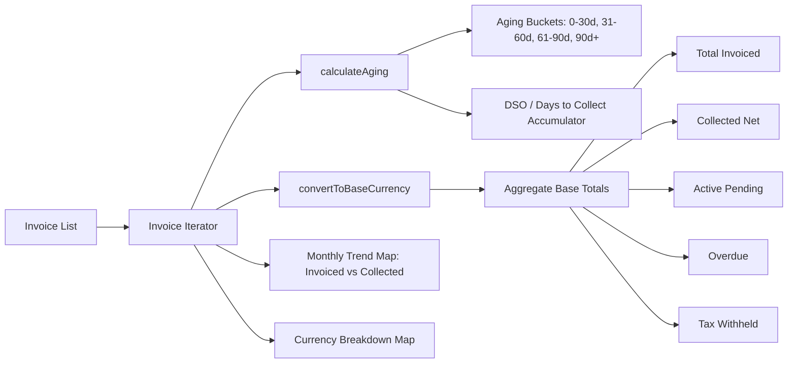

# System Architecture & Technical Design

This document details the architectural principles, component topology, state flow, and data processing pipelines of **Invoice Tracker**.

---

## 1. Architectural Principles

Invoice Tracker is built as a **zero-backend, client-side single page application (SPA)** adhering to the following core tenets:

1. **Deterministic Financial Math**: All calculations (due dates, aging, currency conversions, tax deductions) are executed in pure, testable functional utilities isolated from rendering logic.
2. **Instant Local Persistence**: Application state is continuously synchronized to browser `localStorage`, ensuring zero data loss across reloads, complete user data privacy, and instant offline availability.
3. **Product UI Precision**: Handcrafted Vanilla CSS design system leveraging OKLCH color spaces, Bento Grid layout patterns, and monospace tabular numerals (`JetBrains Mono`).
4. **Bidirectional Spreadsheet Fidelity**: Strict 1:1 data schema compatibility with standard Excel spreadsheet models (`Invoice Tracker.xlsx`).

---

## 2. Component Topology & Hierarchy



---

## 3. State Management Architecture (`useFinanceStore`)

State management is centralized within `src/hooks/useFinanceStore.js`, exposing a clean reactive interface without the boilerplate of heavy external state libraries.

```
+-------------------------------------------------------------------------+
|                           useFinanceStore                               |
|                                                                         |
|  State Slices:                                                          |
|  - invoices: Array<Invoice>             - searchQuery: String           |
|  - clients: Array<Client>               - statusFilter: String          |
|  - settings: BusinessSettings           - currencyFilter: String        |
|  - baseCurrency: String ("USD")         - monthFilter: String           |
|  - theme: String ("dark" | "light")      - sortField / sortDirection     |
|                                                                         |
|  Mutators & Actions:                                                    |
|  - addInvoice(data)                     - markInvoiceAsPaid(id, data)   |
|  - updateInvoice(id, fields)            - importInvoices(list, mode)    |
|  - deleteInvoice(id)                    - resetToSampleData()           |
|  - duplicateInvoice(id)                 - getNextInvoiceNumber()        |
|                                                                         |
|  Derived Memoized Selectors:                                            |
|  - filteredInvoices: Computed via useMemo based on search + filters     |
+-------------------------------------------------------------------------+
                                   ▲ |
                                   | | Reactive Persistence
                                   | ▼
+-------------------------------------------------------------------------+
|                           Browser LocalStorage                          |
|  - apex_finance_invoices_v1     - apex_finance_settings_v1              |
|  - apex_finance_clients_v1      - apex_finance_base_currency_v1         |
|  - apex_finance_theme_v1                                                |
+-------------------------------------------------------------------------+
```

### Key State Characteristics
- **Optimistic Synchronous Updates**: UI state updates instantaneously.
- **Side-Effect Isolation**: React `useEffect` blocks listen to state changes and serialize JSON payloads to `localStorage` safely wrapped in try-catch guards.
- **Auto-Provisioning of Clients**: When an invoice is created with a client name not present in `clients`, `useFinanceStore` automatically registers a new client profile with default payment terms and currency.
- **Sequence Generation**: `getNextInvoiceNumber` scans all existing invoice numbers, extracts digits via regex `/\d+/`, computes the max integer, and produces the next zero-padded sequence (e.g. `SnS02535`).

---

## 4. Data Processing Pipelines

### 4.1 Excel Ingestion Pipeline (`excelHandler.js`)

The Excel ingestion pipeline parses uploaded `.xlsx`, `.xls`, or `.csv` files asynchronously using `SheetJS` (`xlsx`).



#### Header Synonym Normalization Map
To accommodate various Excel templates, the parser normalizes diverse header naming conventions:
- **Invoice Number**: `"Invoice #"`, `"Invoice No"`, `"Invoice"`, `"Invoice \n#"`
- **Client Name**: `"Client Name"`, `"Client"`
- **Amount**: `"Actual Invoiced Amt"`, `"Amount"`, `"Invoiced Amt"`
- **Payment Mode**: `"Mode of Payment"`, `"Payment Mode"`
- **Currency (UOM)**: `"UOM"`, `"Currency"`
- **Raised Date**: `"Raised on"`, `"Raised Date"`, `"Date"`
- **Received Date**: `"Received on"`, `"Received Date"`
- **Status**: `"Collection Status"`, `"Collection \nStatus"`, `"Status"`
- **Remarks**: `"Remarks"`, `"Notes"`

---

### 4.2 Financial Calculation Pipeline (`calculations.js`)

All financial computations run through `calculateFinancialMetrics()`:



---

### 4.3 PDF Vector Generation Pipeline (`InvoicePreviewModal.jsx`)

PDF invoices are compiled directly on the client side using vector geometry via `jsPDF`, avoiding bloated HTML canvas rendering for crisp text reproduction:
1. **Document Setup**: A4 canvas grid dimensions (595pt x 842pt).
2. **Branding & Coordinates**: Company header, invoice metadata header, and separator rules.
3. **Billed-To & Terms Section**: Client name, payment mode, and payment terms.
4. **Service Table**: Rendered with column headers and right-aligned monospace monetary values.
5. **Totals & Withholding Tax**: Displays subtotal, tax deduction discount (if any), and grand total.
6. **Remittance Notes**: Splits bank instructions and remarks using `doc.splitTextToSize`.

---

## 5. Bento Grid Layout Architecture

The executive dashboard employs a **12-column Bento Grid** system:

```
+-----------------------------------------------------------------------------+
|                          Bento Wrapper (12 Columns)                         |
+------------------------------------------+----------------------------------+
| Card 1: Realized Cash & Collection Rate  | Card 2: Receivables & Aging Risk |
| (Span 7 Columns)                         | (Span 5 Columns)                 |
| - Net Collected (Large Monospace)        | - Active Pending within terms    |
| - Collection Rate Badge (e.g. 95%)       | - Overdue Amount past due terms  |
| - Dual-Color Progress Realization Bar    | - Overdue Days / Action Badge    |
| - Substats: Tax Withheld | DSO Speed     | - Aging Micro-Strip (30/60/90d)  |
+------------------------------------------+----------------------------------+
| Card 3: Monthly Cash Flow Momentum       | Card 4: Multi-Currency Allocation|
| (Span 7 Columns - Expanded View)         | (Span 5 Columns - Expanded View) |
| - Dual-bar chart: Invoiced vs Collected  | - Native Currency Balances       |
| - Month labels (Jan, Feb, ...)           | - Invoice Count & Active UOMs    |
+------------------------------------------+----------------------------------+
```

### Responsive Breakpoints
- **Desktop (≥ 1080px)**: 12-column Bento grid (`span 7` + `span 5`).
- **Tablet & Mobile (< 1080px)**: Cards automatically expand to `span 12` (single-column stack) ensuring touch accessibility and zero text clipping.

---

## 6. Security, Performance & Data Isolation

- **Zero Cloud Leakage**: No financial transaction data or client contact details leave the browser.
- **XSS & Injection Protection**: User inputs in the table, preview modals, and PDF generators are sanitized and rendered using React text nodes and vector text calls.
- **Memory Footprint**: Bundle size is optimized via Vite tree-shaking, lightweight CSS design tokens, and modular Lucide icon imports.
