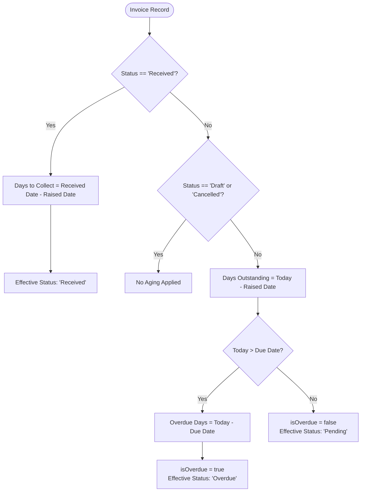

# Financial Calculation Engine Specification

This document provides the mathematical specifications, algorithms, formulas, and business logic implemented in `src/utils/calculations.js`.

---

## 1. Overview of Financial Logic

The financial engine executes all date mathematics, currency conversions, overdue aging assessments, tax withholding calculations, and ledger aggregations.

```
                    +-----------------------------+
                    |        Raw Invoice          |
                    | (amount, currency, dates,   |
                    |  status, terms, taxRate)    |
                    +--------------+--------------+
                                   |
         +-------------------------+-------------------------+
         |                                                   |
         ▼                                                   ▼
+-----------------------+                           +-----------------------+
|   Aging Calculator    |                           |  Currency Converter   |
| - Days Outstanding    |                           | - USD Pivot Normalize |
| - Days to Collect     |                           | - Base Currency Value |
| - Overdue Detection   |                           +-----------+-----------+
+-----------+-----------+                                       |
            |                                                   |
            +-------------------------+-------------------------+
                                      |
                                      ▼
                        +---------------------------+
                        |  Financial Metrics Engine |
                        | - Gross Total Invoiced    |
                        | - Net Realized Cash       |
                        | - Active Pending vs Due   |
                        | - Tax Withheld / TDS      |
                        | - DSO Speed & Buckets     |
                        +---------------------------+
```

---

## 2. Mathematical Formulas & Algorithms

### 2.1 Due Date & Payment Term Computation

Given an invoice creation date ($D_{\text{raised}}$) and selected payment terms ($T_{\text{days}}$):

$$D_{\text{due}} = D_{\text{raised}} + T_{\text{days}}$$

Supported term presets:
- **Due Immediately (Net 0)**: $T_{\text{days}} = 0$
- **Net 15**: $T_{\text{days}} = 15$
- **Net 30** (Standard Default): $T_{\text{days}} = 30$
- **Net 45**: $T_{\text{days}} = 45$
- **Net 60**: $T_{\text{days}} = 60$
- **Custom Due Date**: $D_{\text{due}}$ explicitly defined by the user.

---

### 2.2 Aging & Overdue Logic (`calculateAging`)

Let $D_{\text{today}}$ be the current calendar date normalized to `00:00:00 UTC`.



#### Formulas:

1. **For Settled Invoices (`status === 'Received'`):**
   $$\text{DaysToCollect} = \max\left(0, \left\lfloor \frac{D_{\text{received}} - D_{\text{raised}}}{86,400,000 \text{ ms}} \right\rfloor\right)$$

2. **For Active Invoices (`status === 'Pending'`):**
   $$\text{DaysOutstanding} = \max\left(0, \left\lfloor \frac{D_{\text{today}} - D_{\text{raised}}}{86,400,000 \text{ ms}} \right\rfloor\right)$$

3. **Overdue Condition:**
   $$\text{isOverdue} = \begin{cases} \text{true} & \text{if } D_{\text{today}} > D_{\text{due}} \text{ and } \text{status} \neq \text{'Received'} \\ \text{false} & \text{otherwise} \end{cases}$$
   $$\text{OverdueDays} = \max\left(1, \left\lfloor \frac{D_{\text{today}} - D_{\text{due}}}{86,400,000 \text{ ms}} \right\rfloor\right)$$

---

### 2.3 Tax Deduction & Withholding Reconciliation

For invoices where withholding tax, TDS (Tax Deducted at Source), or statutory client deductions apply:

Given Gross Invoiced Amount ($A_{\text{gross}}$) and Withholding Tax Rate ($R_{\text{tax}} \in [0, 100]$):

1. **Tax Deduction Amount:**
   $$A_{\text{tax}} = \text{round}\left( \frac{A_{\text{gross}} \times R_{\text{tax}}}{100}, 2 \right)$$

2. **Net Realized Amount Credited:**
   $$A_{\text{net}} = \text{round}\left( A_{\text{gross}} - A_{\text{tax}}, 2 \right)$$

*Example*: Invoice `SnS02532` has $A_{\text{gross}} = \$3,381.95$ and $R_{\text{tax}} = 15\%$:
- $A_{\text{tax}} = \frac{3381.95 \times 15}{100} = \$507.29$
- $A_{\text{net}} = 3381.95 - 507.29 = \$2,874.66$

---

### 2.4 Multi-Currency Normalization Engine (`convertToBaseCurrency`)

To aggregate portfolios with diverse transactional currencies (`USD`, `CHF`, `GBP`, `EUR`, `INR`, `CAD`, `AUD`, `SGD`), the engine normalizes all amounts into a selected **Base Currency** ($C_{\text{base}}$) using a USD pivot model.

Let $r_c$ be the exchange rate of currency $c$ against 1 USD (e.g. $1 \text{ GBP} = 1.28 \text{ USD}$, $1 \text{ CHF} = 1.14 \text{ USD}$, $1 \text{ INR} = 0.012 \text{ USD}$).

To convert an amount $A$ from source currency $C_{\text{from}}$ to target base currency $C_{\text{base}}$:

$$A_{\text{USD}} = A \times r_{C_{\text{from}}}$$

$$A_{\text{base}} = \frac{A_{\text{USD}}}{r_{C_{\text{base}}}}$$

#### Default Exchange Rate Matrix:
| Currency Code | Symbol | Name | Rate to USD ($r$) |
| :--- | :--- | :--- | :--- |
| **USD** | `$` | US Dollar (Anchor) | 1.00 |
| **EUR** | `€` | Euro | 1.08 |
| **GBP** | `£` | British Pound | 1.28 |
| **CHF** | `CHF ` | Swiss Franc | 1.14 |
| **CAD** | `CA$` | Canadian Dollar | 0.74 |
| **AUD** | `AU$` | Australian Dollar | 0.66 |
| **SGD** | `SG$` | Singapore Dollar | 0.75 |
| **INR** | `₹` | Indian Rupee | 0.012 |

---

### 2.5 Days Sales Outstanding (DSO) Turnaround Speed

The average DSO speed measures collection velocity across all settled invoices:

$$\text{DSO}_{\text{avg}} = \begin{cases} \text{round}\left( \frac{\sum_{i \in \text{Received}} \text{DaysToCollect}_i}{N_{\text{Received}}} \right) & \text{if } N_{\text{Received}} > 0 \\ 0 & \text{otherwise} \end{cases}$$

---

### 2.6 Aging Buckets Allocation

Unsettled invoices are categorized into standardized aging buckets based on overdue days:

- **Current (Within Terms)**: $D_{\text{today}} \le D_{\text{due}}$
- **1–30 Days Overdue**: $1 \le \text{OverdueDays} \le 30$
- **31–60 Days Overdue**: $31 \le \text{OverdueDays} \le 60$
- **61–90 Days Overdue**: $61 \le \text{OverdueDays} \le 90$
- **90+ Days Overdue**: $\text{OverdueDays} > 90$

---

## 3. Financial Metrics Aggregator Output (`calculateFinancialMetrics`)

The engine returns an aggregated snapshot containing:

```typescript
interface FinancialMetricsResult {
  totalInvoicedBase: number;       // Sum of all gross amounts in Base Currency
  totalReceivedBase: number;       // Sum of all net collected amounts in Base Currency
  totalPendingBase: number;        // Sum of active pending amounts within terms
  totalOverdueBase: number;        // Sum of overdue receivables
  totalTaxWithheldBase: number;    // Sum of tax deductions / TDS withheld
  avgDaysToCollect: number;        // Average collection turnaround in days (DSO)
  collectionRate: number;          // Realization percentage: (Received / Invoiced) * 100
  currencyBreakdown: Record<string, { total: number; received: number; pending: number; count: number }>;
  monthlyData: Array<{ month: string; invoiced: number; received: number; count: number }>;
  agingBuckets: {
    current: number;
    days1_30: number;
    days31_60: number;
    days61_90: number;
    days90Plus: number;
  };
}
```

---

## 4. Edge Cases & Resilience Safeguards

1. **Missing or Incomplete Dates**: Handled gracefully with fallback formatting (`—`), preventing application crashes.
2. **Cancelled & Draft Invoices**: Excluded from active pending and overdue metrics so ledger health is not distorted.
3. **Partial Settlements**: Net received amount is tracked independently of gross invoiced amount.
4. **Zero Gross Invoiced Amount**: Division-by-zero guards in collection rate calculation prevent `NaN` or `Infinity` output.
